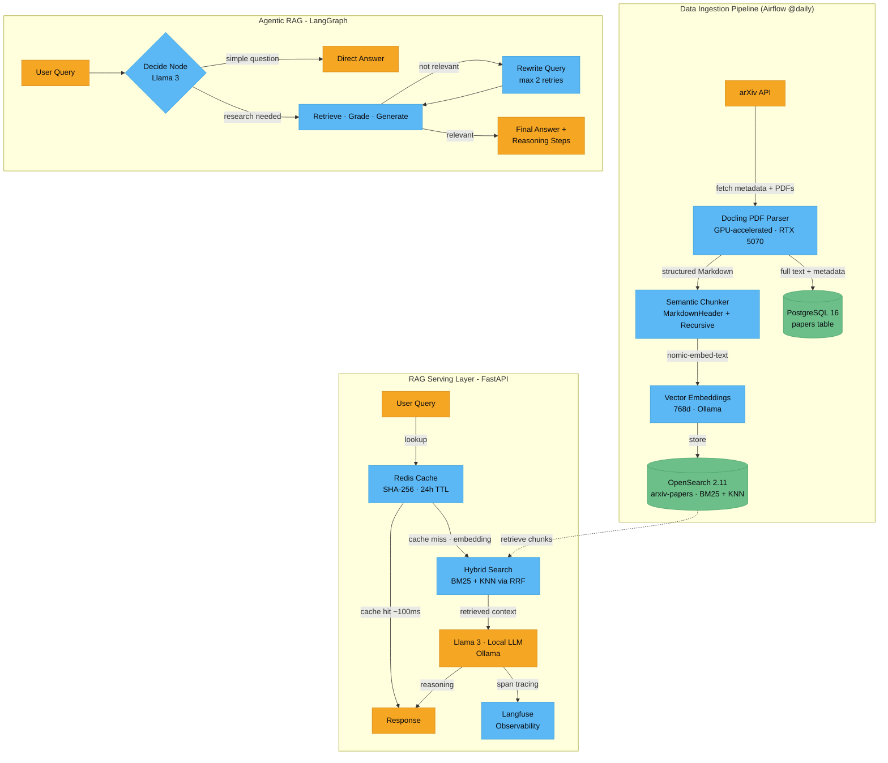
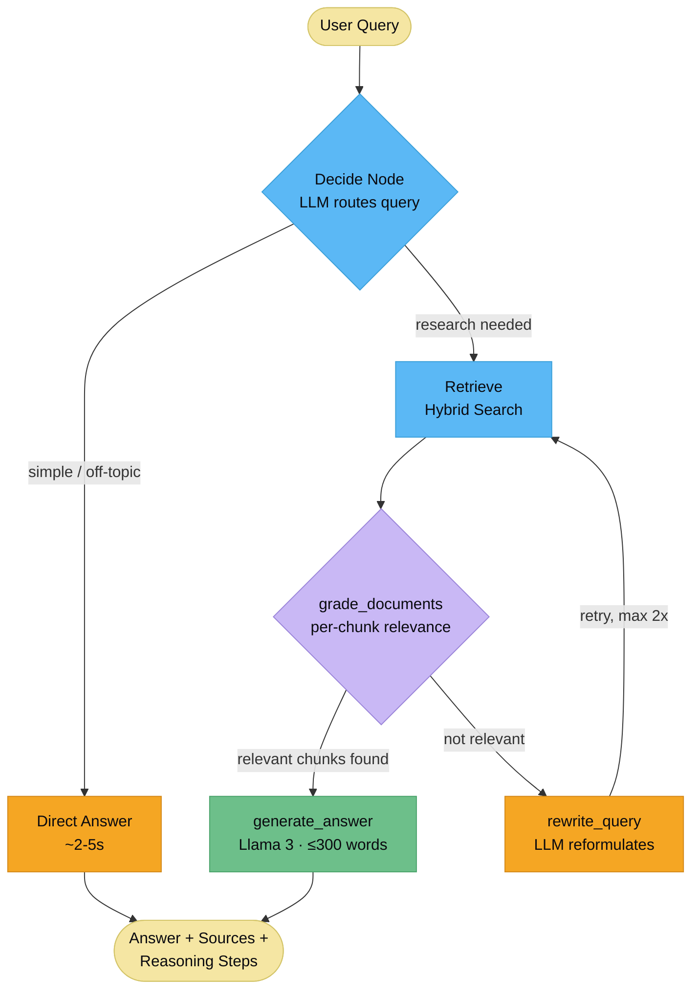

# ScholarStream

**Production-grade RAG pipeline for scientific literature** — arXiv ingestion, GPU-accelerated PDF parsing, hybrid vector search, agentic query routing, and real-time streaming answers.

> Built with: Python 3.12 · FastAPI · LangChain · LangGraph · OpenSearch · Ollama · Airflow · Redis · Langfuse · Docker

---

## Architecture



---

## Agentic RAG Workflow



---

## What's Inside

| Feature | Implementation |
|---|---|
| **PDF Parsing** | Docling with GPU acceleration (RTX 5070) — preserves document structure as Markdown |
| **Semantic Chunking** | Two-stage: MarkdownHeaderTextSplitter → RecursiveCharacterTextSplitter (1500 chars, 150 overlap) |
| **Vector Embeddings** | `nomic-embed-text` via Ollama — 768-dimensional, fully local |
| **Hybrid Search** | Manual Reciprocal Rank Fusion (BM25 + KNN) — OpenSearch 2.11 compatible |
| **Agentic RAG** | LangGraph state machine: decide → retrieve → grade → rewrite → generate |
| **Streaming** | Server-Sent Events (SSE) with token-by-token output |
| **Caching** | Redis — SHA-256 keyed, 24h TTL, 150–400x speedup on cache hits |
| **Observability** | Langfuse v3 — span tracing for embed, retrieve, and generate steps |
| **Scheduling** | Apache Airflow 3.1.7 — `@daily` arXiv ingestion DAG |
| **Local LLM** | Llama 3 via Ollama — zero API costs, fully offline capable |

---

## Performance

| Scenario | Response Time |
|---|---|
| Cache hit (Redis) | ~100ms |
| Standard RAG (`/ask`) | 15–20s |
| Streaming RAG (`/stream`) | 2–3s to first token |
| Agentic — direct response | ~2–5s (no retrieval) |
| Agentic — full pipeline | 20–30s |

---

## Services

```
ss-postgres      PostgreSQL 16         :5432   Paper metadata + full text
ss-opensearch    OpenSearch 2.11.0     :9200   BM25 + KNN vector index (3,700+ chunks)
ss-dashboards    OpenSearch Dashboards :5601   Search index UI
ss-ollama        Ollama                :11434  Local LLM inference (GPU)
ss-airflow       Apache Airflow 3.1.7  :8080   Daily ingestion scheduler
ss-redis         Redis 7 Alpine        :6379   Response cache
ss-api           FastAPI + Uvicorn     :8000   RAG serving layer + UI
```

---

## API Endpoints

| Method | Endpoint | Description |
|---|---|---|
| `POST` | `/ask` | Full RAG Q&A with caching and Langfuse tracing |
| `POST` | `/stream` | SSE streaming RAG — token-by-token output |
| `POST` | `/ask-agentic` | Agentic RAG via LangGraph with reasoning steps |
| `POST` | `/hybrid-search` | BM25 + KNN hybrid search (RRF fusion) |
| `GET/POST` | `/search` | BM25 keyword search with highlights |
| `GET` | `/ui` | Browser UI (served from `scholarstream_ui.html`) |
| `GET` | `/health` | API, OpenSearch, Redis, and Langfuse status |
| `GET` | `/stats` | Index document count and size |
| `POST` | `/cache/flush` | Clear all Redis cache entries |

---

## Quick Start

```bash
# 1. Clone and configure
git clone https://github.com/harshini1331/ScholarStream
cd ScholarStream
cp .env.example .env   # add your Langfuse keys

# 2. Start all services
docker compose up --build -d

# 3. Ingest landmark ML papers (one-time)
docker exec ss-api /opt/venv/bin/python ingest_landmarks.py

# 4. Open the UI
open http://localhost:8000/ui
```

### Environment Variables

```bash
LANGFUSE_SECRET_KEY=sk-lf-...
LANGFUSE_PUBLIC_KEY=pk-lf-...
LANGFUSE_BASE_URL=https://cloud.langfuse.com
REDIS__TTL_HOURS=24
```

---

## Example Queries

```bash
# Standard RAG
curl -X POST http://localhost:8000/ask \
  -H "Content-Type: application/json" \
  -d '{"question": "How does DDPM generate images?", "top_k": 5}'

# Streaming
curl -X POST http://localhost:8000/stream \
  -H "Content-Type: application/json" \
  -d '{"question": "Explain the attention mechanism", "top_k": 3}' \
  --no-buffer

# Agentic RAG
curl -X POST http://localhost:8000/ask-agentic \
  -H "Content-Type: application/json" \
  -d '{"query": "What makes LLaMA different from GPT-3?", "top_k": 4}'
```

---

## Corpus

The index ships with **3,700+ semantic chunks** from:
- Foundational papers: Attention Is All You Need, BERT, GPT-3, LLaMA 1/2, Mistral
- Diffusion models: DDPM, Latent Diffusion Models, DALL-E 2
- RAG papers: original RAG (Lewis et al.), Atlas, Self-RAG
- Vision: ViT, CLIP, SAM
- Agents: ReAct, Tree of Thoughts
- Recent arXiv papers across LLMs, Computer Vision, and Diffusion

---

## Tech Stack

`Python 3.12` `FastAPI` `LangChain` `LangGraph` `OpenSearch` `PostgreSQL` `Ollama` `Llama 3` `nomic-embed-text` `Apache Airflow` `Redis` `Langfuse` `Docling` `Docker` `NVIDIA CUDA 12.4`